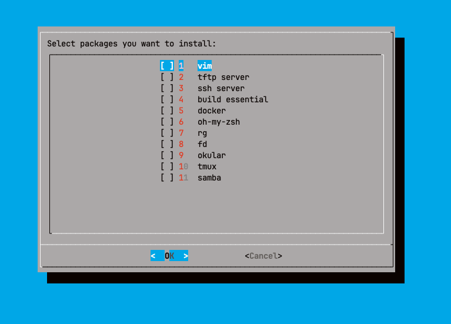

# This shell script is designed to install commonly used utilities and tools on an Ubuntu Linux system, including:

- vim
- tftp server
- ssh server
- build essential
- docker
- oh-my-zsh
- rg
- fd
- okular
- tmux
- samba

## I utilize the dialog package to create an interactive user interface (UI).

